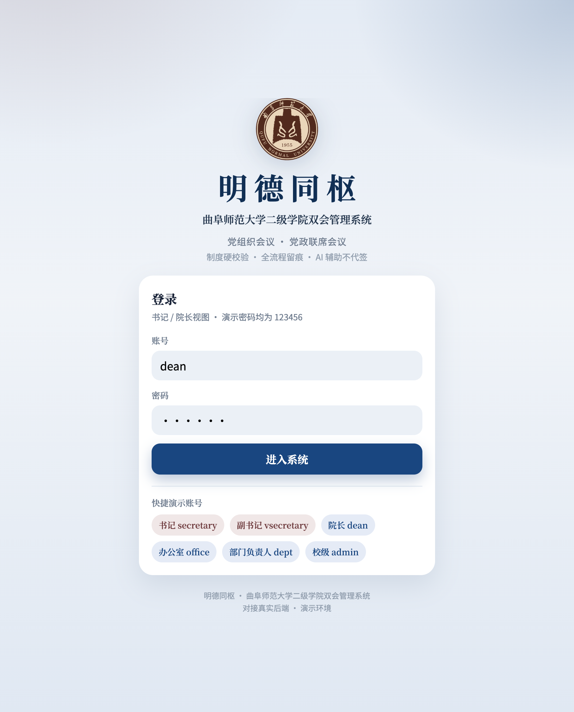
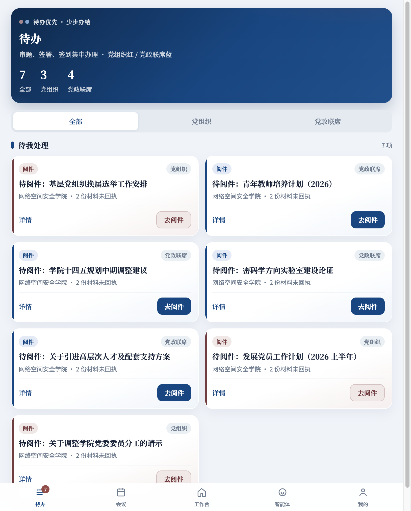

# 明德同枢  
## 曲阜师范大学二级学院双会管理系统  
### 校领导专题汇报材料（图文版）

| 项目 | 内容 |
|------|------|
| 系统全称 | 明德同枢—曲阜师范大学二级学院双会管理系统 |
| 制度依据 | 《学院党委（党总支）会议议事规则》《学院党政联席会议议事规则》（曲师大委字〔2021〕19、20 号） |
| 建设定位 | **学院规范议事的作业系统** · **学校监管督查的治理抓手** · **巡视迎检的证据链条** |
| 汇报目的 | 汇报一期功能成效，提请原则同意 **试点后全校推广** |
| 演示环境 | http://10.31.26.22:5173 |

---

## 一、汇报开场：一句话讲清系统

各位领导：

我们建设的不是“又一个填表层”，而是把二级学院两会制度——**党组织会议与党政联席会议——真正装进系统**：

> **规矩上线，议事留痕；校院同枢，决而有行。**

产品名「**明德同枢**」取义：明德立身、同枢共治——学院照章办事，学校一目了然。

*图1 系统门户：校徽 +「明德同枢」主品牌 + 二级学院双会管理系统正式全称*

---

## 二、为什么现在必须建（领导关切的三道题）

### 1. 管党治校：制度不能只挂墙上

两会是学院议事决策主渠道。现实中常见：

- 法定人数、双审、回避、表决口径依赖“口头提醒”；  
- 议题、签到、表决、纪要、督办散落在 Word / 表格 / 微信；  
- 会开完“没下文”，逾期难发现；  
- 巡视迎检靠突击汇编。

系统目标很明确：

> **把软约束变成硬流程：不合规则阻断，议而有决、决而有行、行而有果。**

### 2. 学校监管：要态势，不要事无巨细代学院开会

校领导和组织部最需要的不是“替学院开一遍会”，而是：

- **本月谁开了、谁没开**；  
- **哪里预警、风险集中在哪**；  
- **巡视材料能否一键打包**。

这正是一期校级监管看板已经交付的能力。

### 3. 数字化要守底线：AI 提效，审签必须人办

系统明确四条红线（门户与智能体均提示）：

> **AI 不自动同意审题 · 不自动形成决议 · 不自动签署纪要 · 不自动办结督办。**

---

## 三、领导最该看的能力（按重视程度排序）

### （一）校级监管：一眼看全校两会是否“按月按规定”

**这是面向校领导最核心的演示页。**

组织部 / 校级管理员进入「校级监管」，可见：

1. **本月双会齐全院数**、**缺党组织会**、**缺联席会**、**预警合计**；  
2. **未按规定召开清单**（精确到学院、会种）；  
3. **预警摘要**：缺开、合规失败、督办逾期、纪要未双签、前置把关缺失；  
4. **学院对比台账**：已开 / 未开、双审完成率、办结率、人数风险；  
5. **一键导出全校（或本院）巡视材料包**（ZIP）。

*图2 校级监管一期：本月召开态势 · 缺开告警 · 预警汇总 · 学院对比 · 巡视导出*

**给领导的价值表述：**

| 以前 | 现在 |
|------|------|
| 月末靠报表、电话催问“开了没有” | 本月实时看板，缺开名单直接列出 |
| 巡视前突击搜集材料 | 随时导出巡视包，过程证据在系统里 |
| 问题发现滞后 | 逾期督办、未双签纪要提前预警 |

> **校级侧：跨院监管、态势感知、预警催办、材料导出——不替代学院开会，但让制度执行“看得见、管得住”。**

---

### （二）学院端：把制度动作压成“待办办结”

书记、院长、委员打开「待办」，审题、阅件、签到、纪要签署集中办理；  
**党组织**与**党政联席**分色分轨，避免混办、替办。

*图3 待办大厅：党组织红轨 / 党政联席蓝轨，任务可点选办结*

**领导可强调的点：**

- 干部少走弯路——“打开待办就能办”；  
- 会务办规范——不会因遗忘手续留下程序瑕疵；  
- 颜色即制度边界——两会各负其责。

---

### （三）会议现场：法定人数 · 议程表决 · 纪要签署闭环

进入会议详情，流程节点清晰：**签到 → 讨论 → 决议 → 签纪要**。

系统对到会人数、表决门槛、重大事项占比等进行校验；未达标则风险可见、关键动作受限。

*图4 会议详情：法定人数展示、议程表决、流程进度一目了然*

纪要支持按议程成稿 / AI 润色草稿 → **人工核对** → 保存 → **书记（及制度要求的双签）签署生效** → 可导出 Word。

*图5 纪要办理：辅助起草不替代签署，生效动作必须由有权主体完成*

---

### （四）工作台与智能体：减负提效，不越权

**工作台**统一议题征集、议题库、会议管理入口，服务秘书处与办公室日常运转。

*图6 工作台：党组织会议 / 党政联席会议分入口办事*

**会议智能体**用于今日简报、待办查询、议事规则问答、材料辅读。界面明确标注：**辅助找事 · 不替代审签**。

*图7 智能体：提效工具，制度责任仍在书记、院长等主体*

---

## 四、系统如何把〔2021〕19、20 号“跑起来”

| 制度要求 | 系统落地方式 |
|----------|----------------|
| 两会边界清晰、不得相互替代 | 分轨流程、分色界面、权限与名单分离 |
| 审题把关 | 党组织会书记审题；联席会书记、院长双审 |
| 法定人数 | 一般事项 / 重大事项（2/3）系统校验 |
| 前置把关与转办 | 可转联席落实，链路可追溯 |
| 纪要生效 | 签署留痕后方可生效 |
| 决议落实 | 督办任务、逾期扫描与预警 |
| 学校监管 | 本月召开、缺开、预警、巡视导出 |

一句话：

> **对学院是规范议事的提效工具；对学校是管党治校的治理抓手；对巡视是随时可调的证据链条。**

---

## 五、全校推广的必要性与可行性

### 为什么适合现在推广

1. **政治要求明确**：议事规则已定，缺的是“装进日常”的载体；  
2. **学校最痛的监管点已打通**：本月召开 / 缺开 / 预警 / 巡视包——领导真正要看的内容已经可用；  
3. **学院负担可控**：核心角色是“按待办办理”，不是额外填一套表；  
4. **红线清晰可解释**：AI 辅助但不代签，便于统一口径对外说明。

### 建议推进节奏（请领导原则同意）

| 阶段 | 时间建议 | 目标 |
|------|----------|------|
| **试点** | 1 个学期 | 选取 2–3 个学院；组织部牵头；书记 / 院长 / 秘书分层培训 |
| **复盘** | 试点结束 | 形成制度执行数据、典型案例、问题清单与改进清单 |
| **全校推广** | 下一学期起 | 纳入学院规范议事常规动作；校级看板纳入月度督导 |

**推广后学校将获得：**

- 每月可统计全校两会召开到位率；  
- 对缺开、逾期、未双签形成闭环督导；  
- 巡视巡察材料准备成本显著下降；  
- 数字化赋能与制度刚性相互加强。

---

## 六、提请领导决策事项

恳请领导原则同意：

1. **肯定**「明德同枢」作为二级学院双会数字化抓手的定位与一期建设成果；  
2. **同意**由组织部牵头组织 2–3 个学院试点；  
3. **明确**试点达标后，按计划推进 **全校推广**；  
4. **授权**相关单位配合账号、培训与制度衔接（议事规则执行口径以组织部为准）。

---

## 七、结束语

各位领导：

信息化的价值，不在“界面漂亮”，而在：

> **每一次议事都规范，每一次决议都留痕，每一项落实都可追，全校态势都可看。**

请领导批评指正。汇报完毕。

---

## 附：口头汇报 90 秒口径（可会上宣读）

各位领导，「明德同枢」把学院党组织会议和党政联席会议装进同一套系统：两会分轨、制度硬校验、纪要签署留痕、决议进督办。校级侧可看本月谁缺开、哪里预警，并能一键导出巡视材料包。AI 只做辅助，不替代书记院长审签。建议先试点两三个学院，成熟后全校推广。请领导指示。

---

*材料插图取自演示环境真实界面（2026 年 7 月）。如需投屏版 PPT，可基于本文件各图单独拆成幻灯片。*
