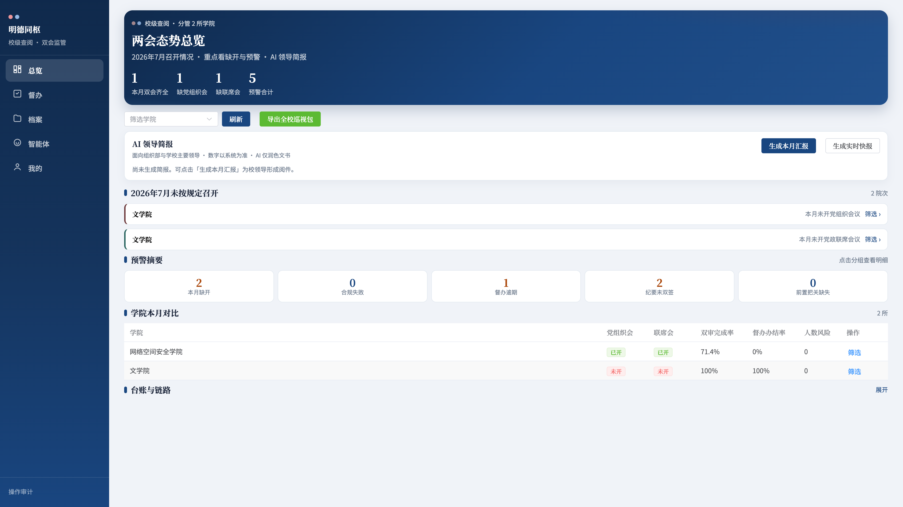

# 明德同枢 · 使用说明书

| 项目 | 内容 |
|------|------|
| 全称 | 明德同枢—曲阜师范大学二级学院双会管理系统 |
| 版本 | 2026-07-22（按现行系统重写） |
| 演示地址 | http://10.31.26.22:5173 |
| 制度依据 | 曲师大委字〔2021〕19、20 号 |
| 配套文档 | [角色与权限说明](./明德同枢角色与权限说明.md) |

---

## 目录

1. [系统是什么](#1-系统是什么)
2. [登录与账号](#2-登录与账号)
3. [两种界面壳](#3-两种界面壳)
4. [主流程](#4-主流程)
5. [待办](#5-待办)
6. [会议](#6-会议)
7. [工作台](#7-工作台)
8. [智能体与 AI](#8-智能体与-ai)
9. [我的](#9-我的)
10. [校级监管与查阅](#10-校级监管与查阅)
11. [系统管理端](#11-系统管理端)
12. [常见问题](#12-常见问题)

---

## 1. 系统是什么

面向全校二级学院，把 **党组织会议** 与 **党政联席会议** 装进同一套系统：不合规则阻断，全过程留痕，决议进督办，校级可看可导出。

> **规矩上线，议事留痕；校院同枢，决而有行。**

门户价值句：**制度硬校验 · 全流程留痕 · AI 辅助不代签**

| 定位 | 一句话 |
|------|--------|
| 学院 | 规范议事的作业系统 |
| 学校 | 监管督查的治理抓手 |
| 迎检 | 巡视材料的证据链条 |

**双轨分色**：党组织轨墨红 · 党政联席轨政务蓝。两条会种流程独立，重大事项可「党委前置 → 转联席」。

**四条红线**：AI **不代审、不代决、不代签、不代办结**。

*图1 门户：校徽 +「明德同枢」+ 快捷演示账号（密码均为 `123456`）*

---

## 2. 登录与账号

打开演示地址 → 填账号密码 → **进入系统**；或点快捷芯片一键填入。

| 账号 | 身份 | 默认落地 | 建议看什么 |
|------|------|----------|------------|
| `secretary` | 党委书记（兼学院管理员） | 待办 | 审题、开会、纪要签署 |
| `vsecretary` | 党委副书记 | 待办 | 党委轨配合办理 |
| `dean` | 院长 | 待办 | 联席双审、纪要双签 |
| `office` | 会议秘书（兼学院管理员） | 待办 | 议题征集、会务、代签到 |
| `dept` | 部门负责人 | 待办 | 申报、列席阅件 |
| `admin` | 校级管理员 | 待办（可进监管） | 态势、简报、巡视导出、系统管理 |
| `viewer` | 校级查阅（全校） | **总览** | 只读监管 |
| `viewer_vp` | 校级分管查阅 | **总览** | 只看文学院 + 网安学院 |

另有文学院 `lit_*`、物理工程学院 `sci_*` 同构账号，便于跨院对比。

完整角色见配套文档。

---

## 3. 两种界面壳

系统按身份自动切换导航，不要混用。

### 3.1 学院用户（五 Tab）

| Tab | 作用 |
|-----|------|
| **待办** | 审题 / 阅件 / 签到 / 纪要签署 / 督办等，集中办结 |
| **会议** | 党组织会议 · 党政联席会议 · 归档会议 |
| **工作台** | 双会办事大厅：议题征集、议题库、会议管理；综合事务 |
| **智能体** | 简报、规则问答、办理引导（不替代审签） |
| **我的** | 消息、人员管理、校级监管入口（有权限时） |

### 3.2 纯校级查阅（五 Tab）

`viewer` / `viewer_vp` 登录后导航收敛为：

| Tab | 作用 |
|-----|------|
| **总览** | 两会态势、预警、AI 领导简报、巡视导出 |
| **督办** | 决议督办（只读） |
| **档案** | 档案中心检索 |
| **智能体** | 简报问答、规则查询、态势解读（不替代审签） |
| **我的** | 消息、返回总览 |

学院会务页（待办、会议、工作台、议题、名单等）对纯查阅账号屏蔽，直接跳转总览；**智能体保留**。

---

## 4. 主流程

| 会种 | 审题 | 纪要生效 |
|------|------|----------|
| 党政联席会议 | 书记 + 院长 **双审**（不一致则暂缓） | 书记 + 院长 **双签** |
| 党组织会议 | 书记审 | 书记或副书记签署 |

### 联席会演示路径（约 10 分钟）

1. `office` → 工作台 · 党政联席 → **议题征集** → 上传材料 → 提交双审  
2. `secretary`、`dean` 分别在议题详情点同意  
3. 会议 · 党政联席 → 创建会议并勾选已通过议题  
4. 签到 → 表决 → 形成决议（自动生成督办）  
5. 保存纪要 → 书记、院长分别签署 → 归档  

### 党组织会议演示路径

工作台 · 党组织 → 议题征集 / 议题库 → 书记审 → 会议 · 党组织会议 → 创建 → 签到表决 → 决议（可转联席）→ 书记/副书记签纪要 → 归档。

---

## 5. 待办

入口：**待办** Tab。筛选：**全部 / 党组织 / 党政联席**。

*图2 待办：党组织红 / 党政联席蓝*

| 类型 | 操作 |
|------|------|
| 审题 | 进入议题详情审核 |
| 阅件 | 阅读材料并回执 |
| 签到 | 进入会议完成本人签到 |
| 纪要签署 | 打开纪要完成签署 |
| 督办 | 跳转督办任务办理 |

优先处理带数字徽章的待办；红蓝分色，避免混轨。

---

## 6. 会议

**会议** Tab 三类列表：党组织会议 · 党政联席会议 · 归档会议。按年月分组，标注「本月第 N 次」。

*图3 党组织会议列表*

*图4 党政联席会议列表*

### 创建会议

填写名称、期次、时间；可选「重大事项会」（法定人数按 **2/3**）。**须至少勾选 1 项议题**，否则按钮置灰。

*图5 创建会议*

### 现场与纪要

流程：**签到 → 讨论 → 决议 → 签纪要**。

*图6 会议详情*

| 区域 | 能力 |
|------|------|
| 工具条 | 本人签到、请假、结束会议、一键全员签到（权限内） |
| 参会签到 | 正式 / 列席人数与状态 |
| 议程表决 | 按议题表决、形成决议 |
| 会议纪要 | AI/一键成稿 → 人工核对 → 保存 → 签署生效 → 可导出 Word |

*图7 纪要编辑与签署*

**归档**：纪要生效后秘书可归档；「归档会议」Tab 可进 **档案中心** 做全宗检索。

---

## 7. 工作台

办事大厅，分三区：

| 分区 | 入口 |
|------|------|
| **党组织会议** | 议题征集 · 议题库 · 会议管理 |
| **党政联席会议** | 议题征集 · 议题库 · 会议管理 |
| **综合** | 决议督办 · 档案中心 · 参会名单（有权限）· 智能体 |

*图8 工作台*

### 议题征集与议题库

- **议题征集**（独立页）：描述事项，可 AI 辅助生成分类/材料建议，确认后入议题库  
- **议题库**：按草稿 / 待审 / 已排会 / 已决议等筛选；已入会题目不可再选  
- 联席可标：党委会前置、临时动议、紧急临机等（按界面补材料与双签）  
- 材料清单随议题分类自动生成  

*图9 党组织会议议题库*

### 决议督办

通过类决议会自动生成任务。可接收、反馈、催办、办结；支持扫描逾期。执行中 **重大调整须回流新议题再上会**，禁止直接改原决议。

---

## 8. 智能体与 AI

**智能体** 为一等 Tab（整页），用于今日简报、待办查询、督办预警、议事规则问答。高风险动作只出确认卡或跳转，**不自动改状态**。

*图10 会议智能体*

| 能力 | 入口 | 说明 |
|------|------|------|
| 材料摘要 / 审题简报 | 议题详情 | 辅读，不可代审 |
| 申报建议 | 议题征集 / 申报 | 须人工确认后提交 |
| 纪要初稿 | 会议详情 | 「采纳到正文」后仍须人工保存与签署 |
| 规则问答 | 智能体 | 基于〔2021〕20 号等知识库 |
| AI 领导简报 | 校级总览 | 月度汇报 / 实时快报，数字与看板同源 |

---

## 9. 我的

展示身份、待办摘要（学院）或查阅说明（校级查阅）、消息中心。

| 入口 | 谁可见 |
|------|--------|
| 消息中心 | 全员 |
| 人员管理 | 学院管理员、党委书记（及校级纠偏） |
| 校级监管 | 校级管理员 |
| 返回总览 | 纯校级查阅 |

*图11 我的（学院）*

---

## 10. 校级监管与查阅

### 10.1 校级管理员（`admin`）

路径：我的 → **校级监管**（或侧栏）。页面标题：**两会态势总览**。

*图12 校级监管看板*

能力：

1. 本月 KPI：双会齐全院数、缺党组织会、缺联席会、预警合计  
2. **AI 领导简报**：生成本月汇报 / 实时快报；可复制、导出、推送消息中心。筛选某学院时标题与内容为该院；留空时管理员为全校，分管查阅为**分管学院**（不再误标「全校」）  
3. 缺开清单、预警摘要、学院对比台账、转办链路  
4. 扫描逾期（管理员）  
5. 导出全校或本院 **巡视材料包**（ZIP）  

### 10.2 校级查阅（`viewer` / `viewer_vp`）

*图13 校级分管查阅（`viewer_vp`）：眉标「分管 2 所学院」· 导航含智能体 · 对比表仅文学院与网安*

- 登录直达总览；导航为总览 · 督办 · 档案 · 智能体 · 我的  
- **只读**：可看态势、预警、简报、导出材料，可用智能体问答；不能进系统管理端，不能代学院开会  
- **分管范围**：`collegeScopes` 为空 = 全校；有配置 = 仅分管学院（演示：`viewer_vp` = 文学院 + 网络空间安全学院）  
- 总览眉标显示「校级查阅 · 全校」或「校级查阅 · 分管 N 所学院」  

---

## 11. 系统管理端

与业务端分离，独立端口（本地默认 `http://localhost:5174`）。**仅校级管理员**可登录。

| 模块 | 作用 |
|------|------|
| 学院管理 | 新增 / 改名；有业务数据的学院禁止删除 |
| 全校用户 | 学院用户、校级管理员、校级查阅；可快捷「设分管」 |
| **分管领导** | 专页维护校级查阅：新增、**设置分管学院**（空=全校；多选=仅分管） |
| 议题分类 | 校级模板与学院覆盖；已被引用的禁止删除 |

业务端侧栏不再放系统管理入口；监管看板仍在业务端。

---

## 12. 常见问题

**创建会议按钮一直灰？**  
未勾选至少 1 项可选议题；已入会题目不可再选。

**纪要如何生效？**  
联席：书记 + 院长双签；党组织：书记或副书记签署。未签会在校级预警中体现。

**重大事项会有何不同？**  
到会法定人数按 2/3 校验。

**列席有表决权吗？**  
没有。缺席书面意见可登记，**不计票**。

**智能体能不能自动审题或签字？**  
不能。只辅助查询与草稿。

**学院账号看不到校级看板？**  
仅校级管理员 / 校级查阅可见。

**`viewer` 和 `viewer_vp` 有何区别？**  
都是校级查阅；前者全校，后者仅分管学院。

**`office` 和 `secretary` 都能管人吗？**  
种子账号二者均兼学院管理员；权限规则上人员管理属于学院管理员或书记（见权限文档）。

---

## 附录 · 培训路径（15 分钟）

1. `secretary` → 待办看红蓝分轨  
2. 工作台 → 议题库 → 打开一条议题  
3. 会议 → 进入进行中会议 → 看签到 / 表决 / 纪要  
4. `viewer_vp` → 总览看分管范围与 AI 简报  
5. `admin` → 校级监管 → 试用导出巡视包  

截图目录：`docs/manual/screenshots/`。角色细则见 [明德同枢角色与权限说明](./明德同枢角色与权限说明.md)。
