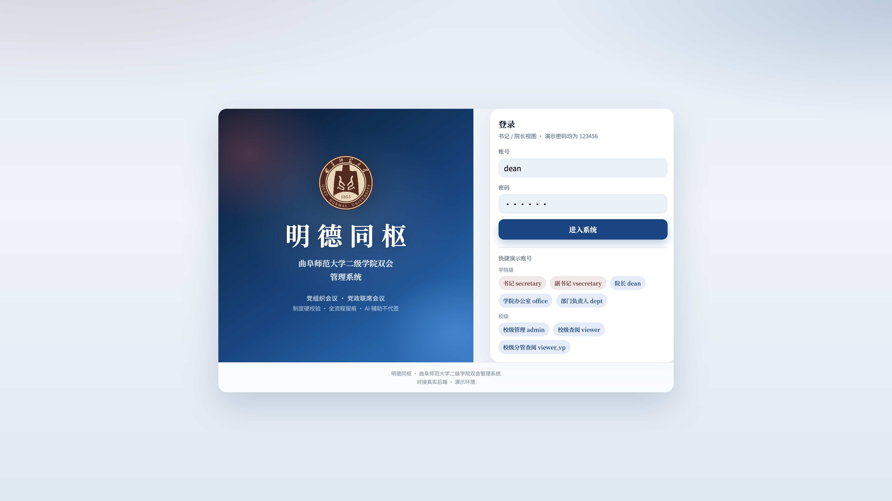
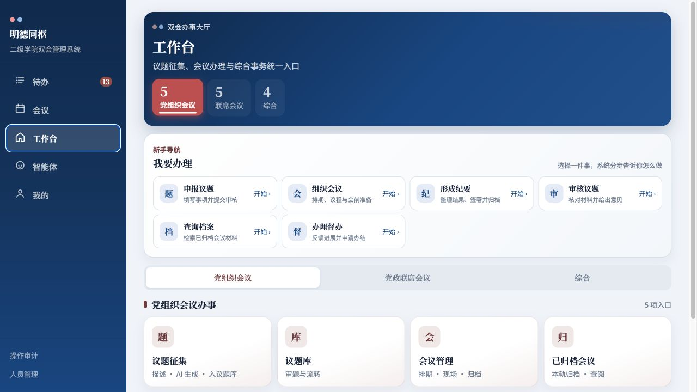
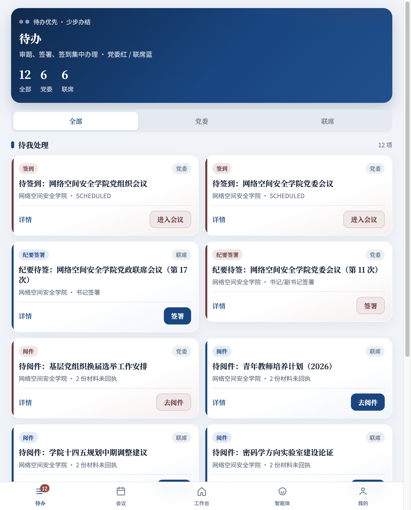
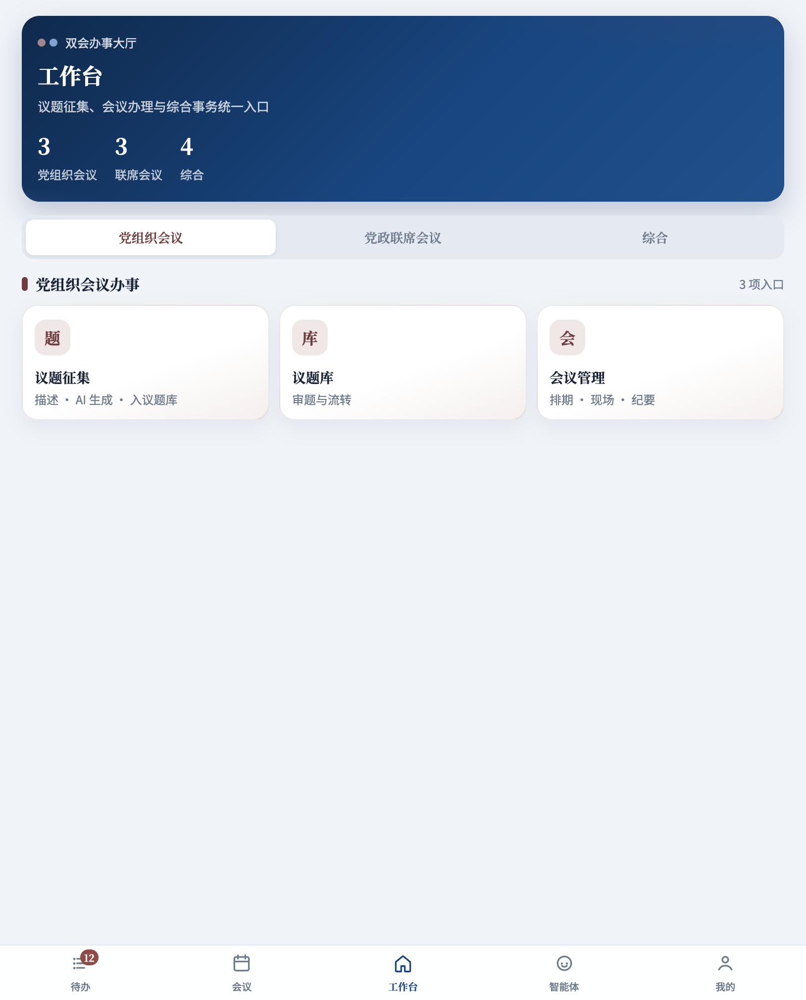
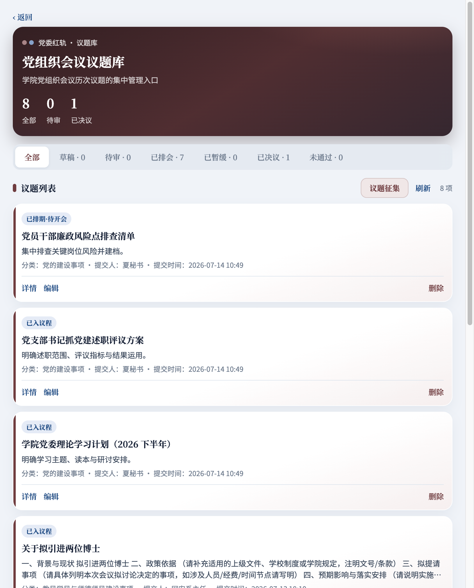
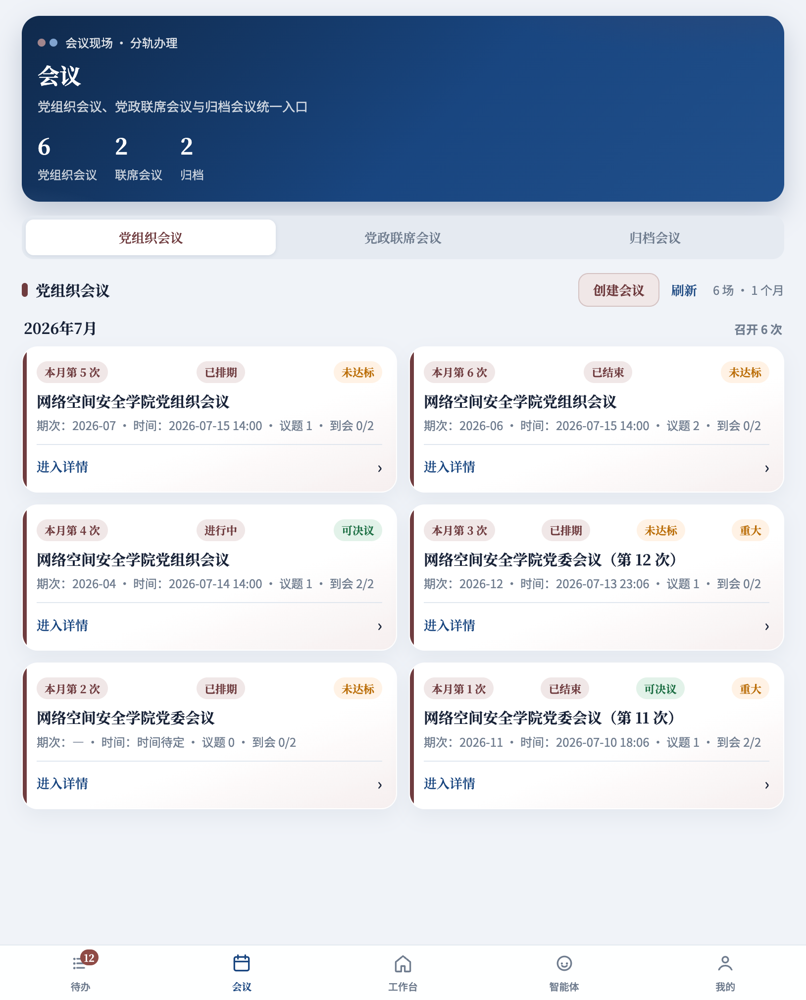
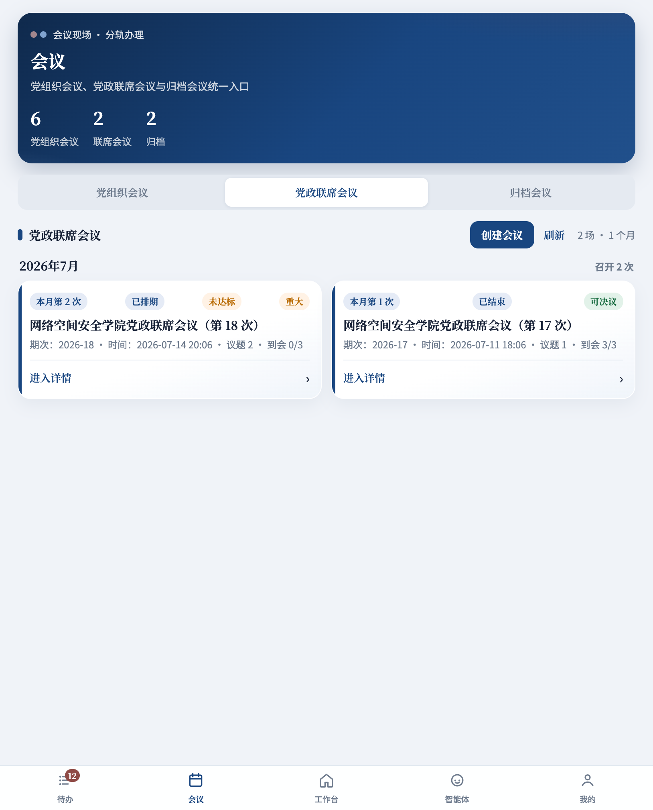
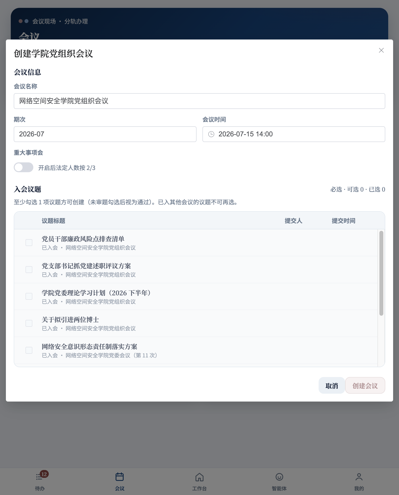
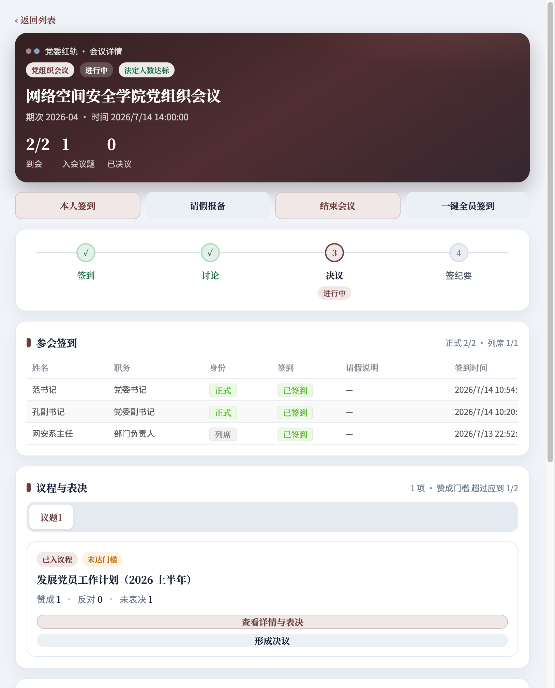
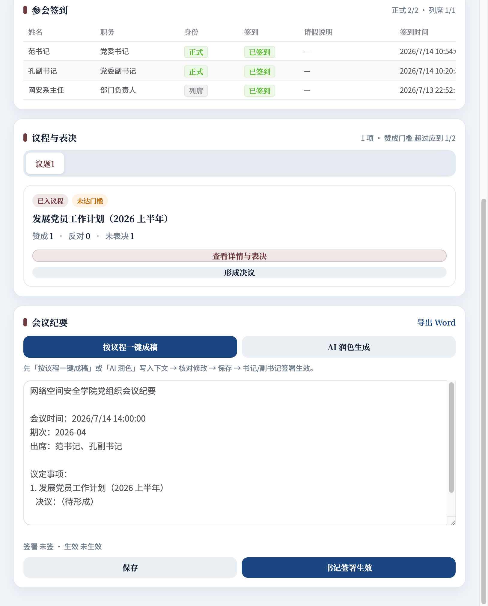

# 明德同枢系统使用说明书（第一批）

*表0-1 文档基本信息*

| 项目 | 内容 |
|------|------|
| 系统全称 | 明德同枢—曲阜师范大学二级学院双会管理系统 |
| 文档版本 | V1.0（第一批） |
| 编制日期 | 2026年8月 |
| 适用地址 | 业务端：http://10.31.26.22:5173 |
| 示例人物 | 王院长（行政负责人） |
| 适用对象 | 以院长操作为主，兼顾会务人员、议题申报人和督办人员 |
| 本批范围 | 快速上手、角色权限、议题申报与审核、会议办理、纪要归档、决议督办 |

> 本说明书以当前生产系统为准。不同账号看到的菜单、按钮和数据范围不同；无法看到某项功能时，应先核对角色和所属学院，不要借用他人账号操作。

> 本文统一以网络空间安全学院“王院长”为示例人物。王院长主要办理党政联席会议题审核、会议阅件与签到、参会表决、联席会议纪要签署等工作。需要会议秘书或议题申报人完成的步骤，会在文中明确标注办理角色。

## 1 快速上手

### 1.1 系统能帮助我做什么

明德同枢把党组织会议与党政联席会议的议题征集、审题、会前准备、现场表决、纪要签署、决议督办和归档查询放在同一套系统中。系统用规则校验阻止不合规操作，并保留全过程记录。

主流程如下：

*表1-1 两类会议规则对照*

| 会议类型 | 议题审核 | 纪要生效 | 界面颜色 |
|------|------|------|------|
| 党组织会议 | 党委书记审核 | 书记或副书记签署 | 墨红色 |
| 党政联席会议 | 书记、院长分别审核；意见不一致则暂缓 | 书记、院长双签 | 政务蓝 |

> AI 可以生成摘要、申报建议和纪要草稿，但不代替人工审核、决策、签署或办结。使用者必须核对 AI 输出后再保存或提交。

### 1.2 王院长的典型使用路线

王院长通常不需要从头创建所有业务。登录后先处理系统分配给自己的待办，再进入具体会议：

1. 使用院长账号登录，确认姓名显示为“王院长”。
2. 打开待办，优先处理“联席审题”“待阅件”“待签到”和“纪要签署”。
3. 审核联席会议题时核对决策事项、前置程序和全部材料。
4. 会前完成阅件和签到，会中完成本人讨论与表决。
5. 会后核对纪要全文，完成院长一方签署。
6. 需要了解决议落实情况时，从工作台进入督办查看。

### 1.3 登录系统

使用浏览器打开业务端地址，输入学校分配的账号和密码，单击“进入系统”。演示环境提供快捷账号，正式使用时应使用本人账号。

*图1-1 系统登录页：王院长使用本人账号进入系统*

登录后先确认右上角或“我的”页面显示的姓名、学院和身份。发现身份错误时立即退出，并联系本院管理员处理。

### 1.4 首次登录引导

王院长首次登录时，系统显示“当前身份：行政负责人”，并提示主要职责为“审核联席议题、参加会议，并完成规定的纪要签署”。建议直接进入待办开始办理。

*表1-2 首次登录引导按钮说明*

| 按钮 | 适合场景 |
|------|------|
| 开始1分钟引导 | 第一次使用，希望依次认识待办、会议和工作台 |
| 直接进入待办 | 已了解系统，希望马上办理工作 |
| 暂时跳过 | 当前只需快速查看信息，稍后再学习 |

在“我的—使用帮助”中可以重新开始引导，也可以在熟悉系统后切换为“熟练模式”。新手模式会在工作台显示“我要办理”。

### 1.5 认识主导航

学院用户主要使用五个入口：

*表1-3 学院用户主导航说明*

| 入口 | 主要用途 | 建议使用频率 |
|------|------|------|
| 待办 | 审题、阅件、签到、纪要签署、督办 | 每次登录先看 |
| 会议 | 查看近期、进行中和归档会议 | 会前、会中使用 |
| 工作台 | 申报议题、管理议题库、组织会议、查询档案 | 发起业务时使用 |
| 智能体 | 规则问答、摘要、办理引导 | 需要辅助时使用 |
| 我的 | 消息、身份、人员管理和使用帮助 | 设置或查消息时使用 |

纯校级查阅人员看到的是“总览、督办、档案、智能体、我的”，不会出现学院办理入口。

### 1.6 从“我要办理”开始

王院长不知道从哪个菜单开始时，可以打开“工作台”，在“我要办理”中选择“审核议题”“查询档案”或“办理督办”。系统会显示分步提示，并可直接跳转到相应页面。

*图1-2 新手模式工作台：按要完成的事情选择入口*

### 1.7 先处理待办

“待办”集中显示当前账号应处理的事项。数字徽章表示尚未完成的数量；红色代表党组织会议轨道，蓝色代表党政联席会议轨道。

*图1-3 待办列表：王院长优先处理联席审题、阅件、签到和纪要签署*

建议顺序：临近会议签到或阅件、即将超期督办、议题审核、纪要签署、普通阅件。处理完成后返回待办，确认该事项已消失或状态已更新。

### 1.8 5分钟操作清单

1. 登录后确认姓名、学院和角色。
2. 打开“待办”，查看是否有红色或蓝色待办。
3. 单击待办的“详情”核对事项，再单击右侧办理按钮。
4. 需要发起业务时打开“工作台—我要办理”。
5. 每次提交后检查状态是否从草稿或待办变为下一阶段。
6. 操作结束后从“我的”退出登录，公共电脑不要保存密码。

## 2 角色与权限

### 2.1 权限的三个边界

系统权限由角色、所属学院和具体业务状态共同决定。角色决定“能做什么”，学院决定“能看哪些数据”，状态决定“现在能不能做”。例如，会务秘书可以创建会议，但只有审核通过且未被其他会议占用的议题才能加入议程。

### 2.2 常用角色权限速查

*表2-1 常用角色权限速查*

| 角色 | 主要职责 | 高频入口 | 关键权限限制 |
|------|------|------|------|
| 党委书记 | 党组织会议题审核、联席议题审核、主持会议、纪要签署 | 待办、会议 | 联席会不能代替院长审核或签署 |
| 院长（王院长） | 联席议题审核、阅件签到、参会表决、联席纪要签署 | 待办、会议 | 不能代替书记完成另一方审核或签署 |
| 党委副书记 | 协助党组织会议办理、按规则签署纪要 | 待办、会议 | 权限取决于会议类型和当前状态 |
| 会议秘书 | 议题征集、会务组织、记录、纪要、归档 | 工作台、会议 | 不得代替领导审核、表决或签署 |
| 学院管理员 | 本院人员、名单和业务配置 | 我的、工作台 | 数据范围限定在授权学院 |
| 部门负责人/申报人 | 申报议题、补充材料、查看本人事项 | 工作台、待办 | 不能进入会议管理和领导审批操作 |
| 正式成员 | 阅件、签到、讨论、表决 | 待办、会议 | 只能进行本人操作；回避时不能表决 |
| 列席人员 | 阅件、签到、参加讨论 | 待办、会议 | 没有表决权 |
| 校级查阅人员 | 查看态势、督办和档案 | 总览、督办、档案 | 只读，不进入学院会务流程 |

### 2.3 为什么看不到按钮

常见原因包括：当前账号没有相应角色、数据不属于授权学院、业务尚未流转到该阶段、前置条件未完成、当前用户处于回避名单，或者事项已经被其他会议占用。

遇到按钮不可用时，先阅读页面上的状态和提示，不要重复提交。仍不能判断时，将“页面名称、事项名称、当前状态、本人角色”提供给本院管理员。

### 2.4 账号使用规范

- 一人一号，禁止共用书记、院长或管理员账号。
- 领导审核、表决和签署必须由本人账号完成。
- 离开公共电脑前必须退出登录。
- 不在截图、聊天群或说明材料中暴露真实密码。
- 人员岗位变化后，由管理员及时调整角色和学院范围。

## 3 议题申报与审核

### 3.1 办理路线

议题申报人完成填写和材料上传，提交后进入审核。党组织会议题由书记审核；党政联席会议题由书记和院长分别审核。审核通过后，议题进入可排会状态。本章重点说明议题到达王院长待办后，王院长如何完成联席审题；申报步骤作为审核前置背景保留。

### 3.2 新建议题

适用角色：会议秘书、学院管理员、部门负责人及有申报权限的人员。

操作步骤：

1. 打开“工作台”。
2. 选择“党组织会议”或“党政联席会议”。
3. 单击“议题征集”，也可以从“我要办理—申报议题”进入。
4. 填写议题名称、背景依据、需要会议研究决定的事项、汇报人等信息。
5. 根据议题性质标记重大事项、党委前置、临时动议等属性。
6. 保存草稿，检查无误后继续上传材料。

*图3-1 工作台：先选择会议轨道，再进入议题征集*

> 议题名称应直接表达“会议要研究决定什么”，避免使用“有关工作”“情况汇报”等无法判断决策事项的模糊名称。

### 3.3 填写议题内容

*表3-1 议题申报字段填写要求*

| 字段 | 填写要求 | 常见错误 |
|------|------|------|
| 议题名称 | 简洁、明确，包含决策对象 | 只写“工作汇报” |
| 背景与依据 | 说明政策依据、现状和必要性 | 只有结论，没有依据 |
| 决策事项 | 列清需要会议决定的具体事项 | 把汇报材料全文粘贴进来 |
| 汇报人 | 选择实际汇报人员 | 选择无关人员 |
| 会议类型 | 按议事规则选择党委会或联席会 | 为简化流程选择错误会种 |
| 重大事项 | 符合规则时勾选 | 应勾选而未勾选，导致人数规则错误 |

### 3.4 上传和检查材料

系统会根据议题分类生成材料清单。逐项上传文件，并确认文件名称、版本和内容正确。涉及经费、人事、采购或重大事项时，应上传对应的前置论证或依据材料。

提交前检查：

- 决策事项与附件内容一致。
- 文件可以正常打开，未上传临时文件或错误版本。
- 涉密等级和材料可见范围设置正确。
- 需要党委前置研究的事项已完成前置程序。
- 临时动议已经补充说明并满足规定的确认条件。

### 3.5 保存草稿与提交审核

“保存草稿”只保存当前内容，不会进入领导待办。确认全部必填项和材料完整后，单击“提交审核”。提交成功后，在议题库查看状态。

*图3-2 议题库：按状态查看草稿、待审、可排会和已决议事项*

结果检查：

- 草稿：尚未提交，可以继续编辑。
- 待审核：已进入审核人的待办。
- 已通过/可排会：可以被会务人员加入会议。
- 已退回：根据审核意见修改后重新提交。
- 已排会：已经加入会议，不能重复选择。

### 3.6 审核议题

适用角色：党委书记、院长及制度规定的审核人员。以下以王院长审核“密码学方向实验室建设论证”为例。

1. 王院长打开“待办”，找到“联席会议题待审：密码学方向实验室建设论证”。
2. 进入详情，核对议题类型、决策事项、前置程序和全部附件。
3. 查看另一方审核意见及系统合规提示。
4. 选择通过或退回，并填写审核意见。
5. 提交后返回待办，确认该项院长审题待办已经消失或状态已更新。

审核重点：议题是否属于该会议议事范围、是否完成必要前置程序、决策事项是否清晰、材料是否完整、是否存在回避情形、是否需要标记重大事项。

> 退回时应写明可执行的修改要求，例如“请补充三家供应商比选材料”，不要只写“不同意”或“材料不全”。

### 3.7 联席会议双审

书记和院长分别独立审核。两方都通过后，议题才进入可排会状态；意见不一致时系统将暂缓上会，由申报人按意见修改或补充材料后重新流转。

### 3.8 议题申报常见问题

*表3-2 议题申报与审核常见问题*

| 问题 | 原因 | 处理方法 |
|------|------|------|
| 保存后审核人看不到 | 仍是草稿 | 返回详情并执行“提交审核” |
| 提交按钮不可用 | 必填字段或材料缺失 | 查看页面红色提示，逐项补齐 |
| 议题不能加入会议 | 未审核通过或已被占用 | 查看议题状态和所属会议 |
| 联席议题一直待审 | 仅一方完成审核 | 查看书记、院长各自审核状态 |
| 议题被退回 | 审核提出修改意见 | 按意见修改并重新提交 |

## 4 会议办理

### 4.1 会前准备路线

会议秘书创建会议，设置时间地点和主持人，从已审核议题中编排议程，确认参会名单和材料，满足条件后发布会议。王院长主要负责会前阅件和签到、会中讨论与本人表决，不代替会议秘书创建或编排会议。

### 4.2 查看会议列表

“会议”按党组织会议、党政联席会议和归档会议分类，并按月份展示期次和状态。

*图4-1 党组织会议列表*

*图4-2 党政联席会议列表*

### 4.3 创建会议

适用角色：会议秘书、学院管理员及有会务权限的人员。本节用于帮助王院长了解会务人员在会议发布前完成了哪些准备。

1. 打开“会议”，选择正确会议类型。
2. 单击“创建会议”。
3. 填写会议名称、期次、日期、时间、地点和主持人。
4. 如属于重大事项会议，勾选相应标记。
5. 从可选议题中至少勾选一项，调整议程顺序。
6. 保存并检查会议详情。

*图4-3 创建会议：填写会议信息并选择已审核议题*

创建按钮置灰时，检查是否已选择议题、必填字段是否完整、议题是否审核通过，以及议题是否已经被其他会议使用。

### 4.4 管理参会名单

正式成员参与法定人数和表决；列席人员可以阅件、签到和讨论，但没有表决权。会前应核对人员身份、应到人数、请假情况和回避名单。

会前检查清单：

- 主持人、正式成员、列席人员设置正确。
- 重大事项会议所需人数规则正确。
- 议题汇报人和列席范围匹配。
- 涉及本人或利益关系的人员已设置回避。
- 会议材料已经向有权限的参会人员开放。

### 4.5 进入会议详情

会议详情集中显示会议信息、签到、议程、讨论、表决、决议和纪要。

*图4-4 会议详情：按签到、讨论、表决和纪要顺序办理*

### 4.6 签到与请假

王院长从待办或会议详情完成本人签到。会议秘书在会议开始前核对签到人数，记录请假情况。系统根据正式成员、回避和会议类型计算人数条件。

> 代签到仅限系统授权的会务场景，并应与实际到会情况一致。不能为了满足法定人数对未到会人员进行签到。

### 4.7 讨论与表决

按议程逐项进行。先记录必要讨论和意见，再进入表决。正式成员拥有表决权；列席、缺席或当前议题回避人员不计入表决。

一般事项赞成票须超过应到会正式成员半数；重大事项按系统规则执行更高比例要求。系统会阻止不满足人数或顺序要求的决议生成。

操作顺序：

1. 打开当前议题。
2. 记录汇报和讨论要点。
3. 确认需要回避的人员未参与讨论或表决。
4. 王院长以正式成员身份完成本人表决。
5. 王院长按系统提示完成规定的最后表态，不由会议秘书代办。
6. 核对票数后形成决议。

### 4.8 形成决议

形成决议前核对赞成、反对和弃权票数，以及应到、实到和回避人数。决议文字应与实际表决结论一致。通过类决议形成后，系统会自动生成督办任务。

### 4.9 会议办理常见问题

*表4-1 会议办理常见问题*

| 问题 | 检查内容 |
|------|------|
| 无可选议题 | 议题是否审核通过、会种是否正确、是否已排入其他会议 |
| 会议不能开始 | 时间、参会名单、材料或发布状态是否满足要求 |
| 表决按钮不可用 | 是否签到、是否为正式成员、是否处于回避状态 |
| 不能形成决议 | 法定人数、赞成比例、讨论顺序或最后表态是否完成 |
| 会议结束后无督办 | 决议是否属于通过类，是否已经成功形成决议 |

## 5 纪要签署与归档

### 5.1 纪要办理路线

会议结束后，会议秘书整理讨论结论和表决结果，生成或编辑纪要，保存后由规定人员签署。王院长从待办进入联席纪要，核对全文后完成院长一方签署。书记和院长均签署后纪要生效，随后才能归档。

### 5.2 生成和编辑纪要

1. 打开已结束的会议详情。
2. 进入“会议纪要”区域。
3. 可以使用系统根据会议记录生成的草稿，也可以人工编写。
4. 核对会议基本信息、出席和列席人员、议题顺序、讨论结论、表决结果和决议内容。
5. 保存纪要正文。

*图5-1 纪要编辑与签署：AI草稿必须人工核对后保存*

### 5.3 纪要核对要点

- 会议名称、时间、地点、主持人准确。
- 出席、请假、列席和回避记录与现场一致。
- 每项议题的讨论结论与表决结果一致。
- 决议文字没有扩大或缩小会议决定范围。
- 责任单位、负责人和完成时限清晰。
- 涉密内容和可见范围符合要求。

### 5.4 完成纪要签署

党政联席会议纪要需要书记和院长分别签署；党组织会议纪要按制度由书记或副书记签署。签署待办会出现在相应领导账号中。

王院长应打开纪要全文，重点核对本人参会情况、议题结论、表决结果和责任分工，不应只根据标题直接签署。发现错误时退回会议秘书修改，不能通过线下口头确认替代系统签署。

### 5.5 归档会议

纪要生效后，由有权限的会务人员执行归档。归档前确认议题材料、签到记录、讨论表决、决议和纪要齐全。归档后可从“归档会议”或“档案中心”检索。

归档检查清单：

- 全部议题已经完成会议处理。
- 表决数据和决议文本完整。
- 纪要已按会议类型完成签署并生效。
- 应归档材料可以正常打开。
- 督办责任和时限已经明确。

### 5.6 历史会议导入

有权限的会务人员可以从工作台进入“历史会议导入”，上传历史议题表、会议记录和纪要等材料。系统先进行预览和解析，人工核对后才确认归档。

导入时应特别检查会议日期、期次、议题拆分、参会人员和决议文字。原始文件格式复杂或扫描质量较低时，以人工核对结果为准。

### 5.7 纪要与归档常见问题

*表5-1 纪要与归档常见问题*

| 问题 | 原因 | 处理方法 |
|------|------|------|
| 领导没有签署待办 | 纪要未保存或尚未提交签署 | 检查纪要状态并发起签署 |
| 联席纪要不能生效 | 书记或院长尚有一方未签 | 查看双签状态 |
| 不能归档 | 纪要未生效或材料不完整 | 按页面提示补齐前置条件 |
| AI草稿内容不准确 | 草稿只用于辅助 | 根据会议记录人工修改后再保存 |
| 归档后发现错误 | 归档内容受控 | 联系管理员按制度处理，保留更正记录 |

## 6 决议督办

### 6.1 督办如何产生

会议形成通过类决议后，系统自动生成督办任务。任务包含来源会议、来源议题、责任单位、负责人、办理期限和当前状态，确保决议从“会上通过”进入“落实闭环”。

### 6.2 进入督办

王院长可以从“工作台—综合—决议督办”查看本院决议落实情况；如果本人被设置为督办责任人，也可以从“待办—去督办”直接进入任务。

### 6.3 办理督办任务

1. 打开督办详情，核对决议原文、责任单位和时限。
2. 接收任务并明确实际经办人。
3. 按阶段填写进展说明，上传必要的佐证材料。
4. 出现延期风险时及时说明原因和拟采取措施。
5. 完成后填写办结结果并提交办结申请。
6. 由有权限的人员审核确认，任务进入办结状态。

### 6.4 进展反馈要求

进展应说明“已经完成什么、还有什么未完成、下一步做什么、预计何时完成”。不要只填写“正在推进”“按计划进行”等无法核验的表述。

佐证材料应与本次进展直接相关，文件名称应包含事项简称、材料类型和日期。涉及个人信息或内部材料时遵守权限和保密要求。

### 6.5 催办、预警与逾期

系统根据办理期限显示临期或逾期状态。有权限的人员可以催办，催办和反馈均进入操作记录。责任人收到预警后应更新真实进度；不能通过修改原决议来消除逾期。

### 6.6 重大调整必须回流议题

执行过程中如需对原决议作重大调整，应重新申报议题并按规定上会研究，不能直接修改原决议文本或以督办反馈代替会议决策。

### 6.7 督办办结检查

- 办结结果逐项回应原决议要求。
- 责任事项确已完成，不以“已安排”代替“已完成”。
- 佐证材料真实、完整、可打开。
- 延期或调整经过规定程序。
- 审核确认后状态显示为办结。

### 6.8 督办常见问题

*表6-1 督办常见问题*

| 问题 | 处理方法 |
|------|------|
| 看不到督办任务 | 核对本人是否为责任人、任务是否已生成、学院范围是否正确 |
| 不能提交反馈 | 检查必填说明、附件和任务当前状态 |
| 申请办结后仍显示处理中 | 等待有权限人员审核确认 |
| 决议内容需要变化 | 新建议题重新上会，不直接改原决议 |
| 已经逾期 | 如实填写原因、进展和完成计划，接受催办和审核 |

## 7 第一批速查附录

### 7.1 按任务找入口

*表7-1 王院长及相关人员任务入口速查*

| 我要做什么 | 从哪里进入 | 完成标志 |
|------|------|------|
| 处理分配给我的工作 | 待办 | 待办消失或进入下一状态 |
| 申报议题 | 工作台—议题征集 | 状态变为待审核 |
| 审核议题 | 待办—审题 | 审核意见和状态已更新 |
| 创建会议 | 会议—创建会议 | 会议进入已排期或已发布状态 |
| 参加会议 | 待办—签到/会议详情 | 已签到并完成本人表决 |
| 编写纪要 | 会议详情—会议纪要 | 纪要已保存并提交签署 |
| 签署纪要 | 待办—纪要签署 | 本人签署状态完成 |
| 归档会议 | 会议详情—归档 | 可在档案中心检索 |
| 反馈督办 | 待办—去督办 | 进展或办结申请已提交 |

### 7.2 求助时提供的信息

联系管理员时，请说明账号姓名、所属学院、当前角色、页面名称、事项名称、当前状态、发生时间和页面提示。截图应隐藏密码、敏感材料和无关个人信息。

### 7.3 版本说明

本文件为第一批操作说明，覆盖最常用的学院业务闭环。校级监管、系统管理、智能体深度使用、历史数据维护和完整故障处理将在第二批说明书中补充。
