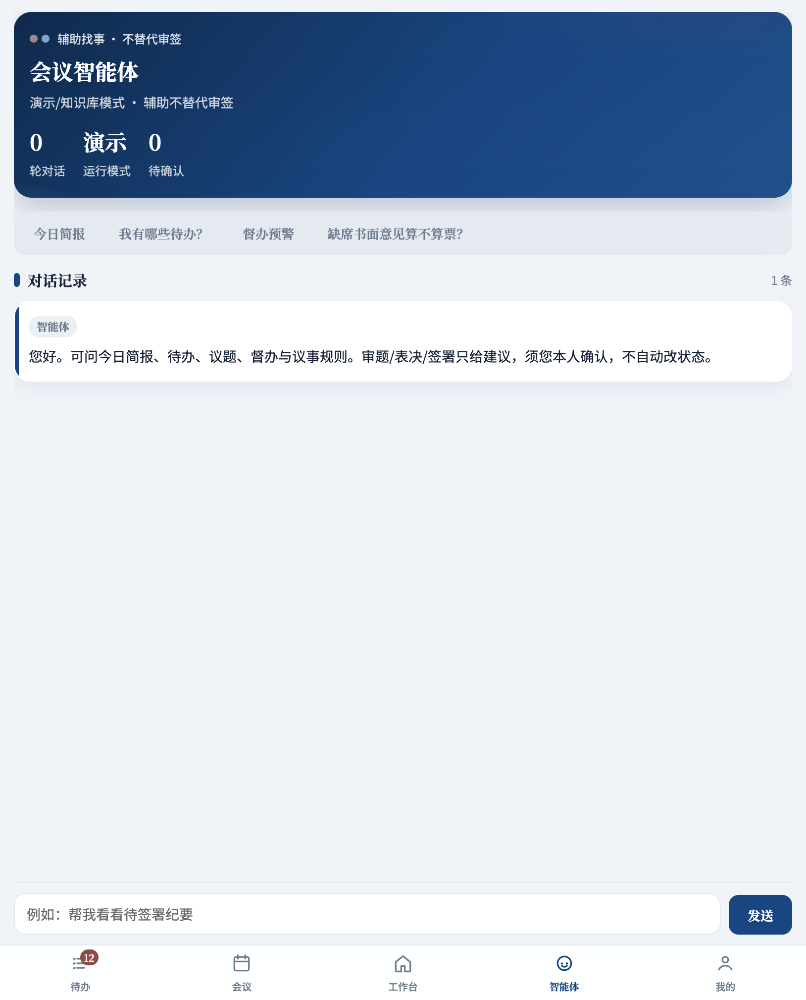
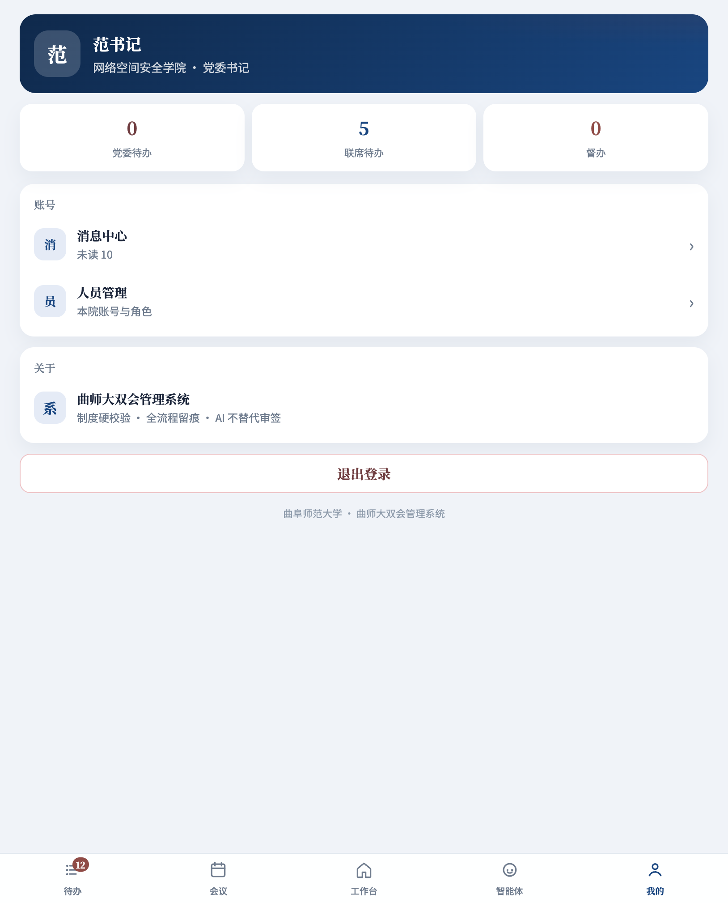
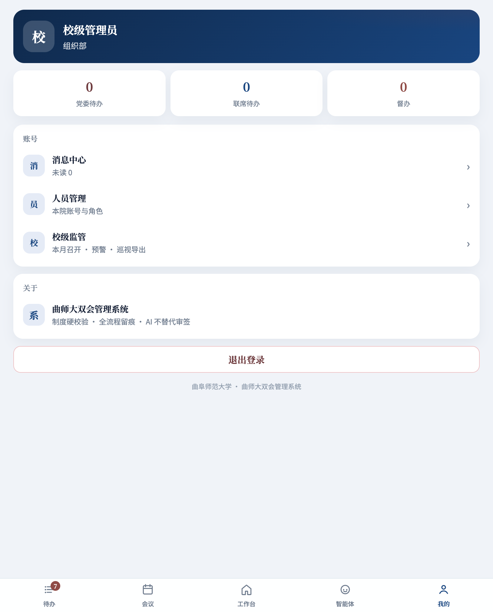
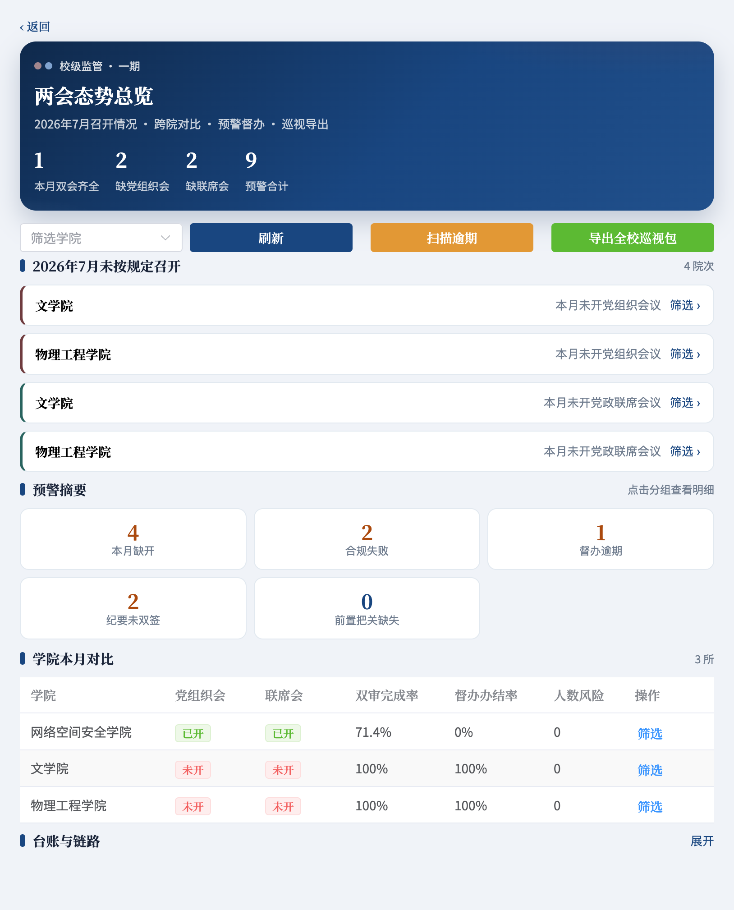

# 曲阜师范大学双会管理系统  
## 使用说明书（图文版）

> **文档版本**：2026-07  
> **演示地址**：http://10.31.26.22:5173  
> **适用范围**：学院端日常办理 · 校级监管一期  
> **截图来源**：演示环境真实界面（自动化截取）

---

## 目录

1. [系统简介](#1-系统简介)  
2. [登录与账号](#2-登录与账号)  
3. [界面总览](#3-界面总览)  
4. [待办办理](#4-待办办理)  
5. [工作台与议题](#5-工作台与议题)  
6. [会议管理](#6-会议管理)  
7. [会议现场与纪要](#7-会议现场与纪要)  
8. [会议智能体](#8-会议智能体)  
9. [我的](#9-我的)  
10. [校级监管（一期）](#10-校级监管一期)  
11. [常见问题](#11-常见问题)

---

## 1. 系统简介

本系统服务学院 **党组织会议** 与 **党政联席会议** 全流程：议题征集 → 审题流转 → 排期开会 → 签到表决 → 纪要签署 → 归档留痕；校级侧提供本月召开态势、预警与巡视材料导出。

**设计原则**

| 原则 | 说明 |
|------|------|
| 制度硬校验 | 入会须选题、人数门槛、签署生效等由系统校验 |
| 双轨分色 | 党委轨墨红 · 联席轨政务蓝 · 主 Tab 官方蓝 |
| 全流程留痕 | 操作可审计，材料可导出 |
| AI 辅助不代签 | 智能体可润色/检索，审题、表决、签署须人工确认 |

---

## 2. 登录与账号

打开演示地址后进入登录页。演示密码均为 `123456`，可点快捷账号一键填入。

**演示账号一览**

| 账号 | 身份 | 主要用途 |
|------|------|----------|
| `secretary` | 党委书记 | 审题、签到、纪要签署、开会 |
| `vsecretary` | 党委副书记 | 配合签署 / 办理 |
| `dean` | 院长 | 联席会相关办理 |
| `office` | 办公室 | 议题与会务支撑 |
| `dept` | 部门负责人 | 议题提交、列席 |
| `admin` | 校级管理员 | 跨院监管、预警、巡视导出 |

操作：选择账号 → 密码 `123456` → **进入系统**。

---

## 3. 界面总览

登录后底部五个主 Tab：

| Tab | 作用 |
|-----|------|
| **待办** | 审题、阅件、签到、纪要签署等集中办理 |
| **会议** | 党组织会 / 联席会 / 归档列表，创建会议 |
| **工作台** | 议题征集、议题库、会议管理入口 |
| **智能体** | 规则问答与办理辅助 |
| **我的** | 消息、人员、校级入口（管理员） |

颜色提示：**党委红 / 联席蓝**，便于区分两条制度轨迹。

---

## 4. 待办办理

进入 **待办**，可按「全部 / 党委 / 联席」筛选。卡片显示类型（签到、纪要签署、阅件、审题等）与办结按钮。

**常见待办类型**

1. **签到** → 进入会议完成本人签到  
2. **纪要签署** → 打开会议纪要，书记/副书记签署生效  
3. **阅件** → 阅读材料并回执  
4. **审题** → 进入议题详情审核  

建议：优先处理带徽章数字的待办；党委项与联席项分色，避免混轨办理。

---

## 5. 工作台与议题

### 5.1 工作台

**工作台** 是办事大厅：按党组织会议 / 党政联席会议 / 综合切换入口。

党组织会议常用三项：

- **议题征集**：填写描述，可借助 AI 成稿后入议题库  
- **议题库**：审题与流转  
- **会议管理**：跳转会议列表（排期 · 现场 · 纪要）

### 5.2 议题库

从工作台进入议题库，可按草稿 / 待审 / 已排会 / 已决议等状态筛选。

要点：

- 议题先入「议题库」，再勾选入会  
- 已入其他会议的议题不可再选  
- 支持详情、编辑（权限内）、删除（草稿等场景）

---

## 6. 会议管理

**会议** Tab 统一管理三类：党组织会议 · 党政联席会议 · 归档会议。顶部显示数量，列表按「年月」分组，并标注「本月第 N 次」。

### 6.1 党组织会议列表

创建按钮为党委轨配色；卡片展示状态（已排期 / 进行中 / 已结束）、是否达标、是否重大事项、到会人数等。

### 6.2 党政联席会议列表

操作与党委轨一致，主题色为政务蓝。

### 6.3 创建会议

点击 **创建会议**，填写名称、期次、时间；可选「重大事项会」（法定人数按 2/3）。**须至少勾选 1 项议题** 方可创建。

规则摘要：

- 未选题不能创建（按钮置灰）  
- 已入会议题灰色不可选  
- 未审题议题勾选入会时按制度视为通过（以系统提示为准）

---

## 7. 会议现场与纪要

点击会议卡片进入详情。党委会议详情页为墨红 Hero，标识「党委红轨」。

**流程节点**：签到 → 讨论 → 决议 → 签纪要。

页面能力概览：

| 区域 | 操作 |
|------|------|
| 工具条 | 本人签到、请假报备、结束会议、一键全员签到（权限内） |
| 参会签到 | 正式 / 列席人数与签到状态 |
| 议程与表决 | 按议题查看、表决、形成决议 |
| 会议纪要 | 成稿、润色、保存、签署生效 |

**纪要办理建议路径**：按议程一键成稿或 AI 润色 → 人工核对修改 → **保存** → **书记/副书记签署生效** → 可导出 Word。

---

## 8. 会议智能体

**智能体** 用于查询待办、简报、督办预警与议事规则问答。界面会提示：**辅助找事 · 不替代审签**。

可点快捷问句（今日简报、待办、督办预警、制度问答等）；涉及审题 / 表决 / 签署时，系统只给建议，**状态变更须本人确认操作**。

---

## 9. 我的

**我的** 展示身份、待办摘要、消息中心与人员管理（有权限时）。

校级管理员可见 **校级监管** 入口：

---

## 10. 校级监管（一期）

使用 `admin` 登录后：侧栏 **校级监管**，或「我的 → 校级监管」。定位是 **跨院监管 / 态势 / 预警 / 导出**，不替代学院开会。

一期能力：

1. **本月召开 KPI**：双会齐全院数、缺党组织会 / 缺联席会、预警合计  
2. **缺开清单**：按学院列出未按规定召开项，可点「筛选」聚焦  
3. **预警摘要**：本月缺开、合规失败、督办逾期、纪要未双签、前置把关缺失  
4. **学院本月对比表**：已开 / 未开、双审率、办结率、人数风险  
5. **导出全校（或本院）巡视包**：ZIP 材料包  
6. **台账与链路**：展开可查看会议台账、转办链路与累计指标  

---

## 11. 常见问题

**Q：创建会议按钮一直灰？**  
A：未勾选至少 1 项可选议题。若全部显示「已入会」，需先征集新议题或从其他未入会题目中勾选。

**Q：纪要如何生效？**  
A：正文保存后，由书记/副书记在详情页点击签署生效；未双签会在校级预警中体现。

**Q：重大事项会有何不同？**  
A：开启后到会法定人数比例按 2/3 规则校验（以界面与制度说明为准）。

**Q：智能体能不能自动审题或签字？**  
A：不能。智能体仅辅助查询与草稿，审签动作必须人工完成。

**Q：学院账号看不到校级看板？**  
A：校级监管仅 `admin`（校级管理员）可见。

---

## 附录 A · 配色与分轨

| 场景 | 配色含义 |
|------|----------|
| 主 Tab Hero | 政务蓝（官方） |
| 党组织会议细分 | 墨红 / 软酒红 |
| 党政联席会议细分 | 青碧 / 政务蓝 |

## 附录 B · 推荐演示路径（培训用）

1. `secretary` 登录 → 看待办红蓝分轨  
2. 工作台 → 议题库 → 打开一条议题详情  
3. 会议 → 党组织会议 → 进入「进行中」会议 → 看签到 / 表决 / 纪要  
4. 退出 → `admin` 登录 → 校级监管看缺月与预警 → 试用导出巡视包  

---

*截图目录：`docs/manual/screenshots/`。如需 Word/PDF 排版版，可将本 Markdown 用 Typora、Pandoc 或 Word「导入」生成。*
